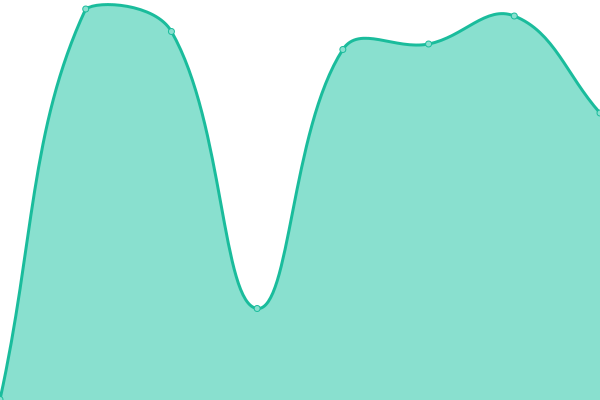

# [📈 Live Status](https://upptime.github.io/upptime): <!--live status--> **🟩 All systems operational**

This repository contains the open-source uptime monitor and status page for [Upptime](https://upptime.js.org), powered by [Upptime](https://github.com/upptime/upptime).

With [Upptime](https://upptime.js.org), you can get your own unlimited and free uptime monitor and status page, powered entirely by a GitHub repository. We use [Issues](https://github.com/upptime/upptime/issues) as incident reports, [Actions](https://github.com/heymaslo/status/actions) as uptime monitors, and [Pages](https://upptime.github.io/upptime) for the status page.

<!--start: status pages-->
<!-- This summary is generated by Upptime (https://github.com/upptime/upptime) -->
<!-- Do not edit this manually, your changes will be overwritten -->
<!-- prettier-ignore -->
| URL | Status | History | Response Time | Uptime |
| --- | ------ | ------- | ------------- | ------ |
|  [OpenAI](https://www.openai.com) | 🟩 Up | [open-ai.yml](https://github.com/HeyMaslo/status/commits/HEAD/history/open-ai.yml) | 

 607ms
     
 | 

<a href="https://heymaslo.github.io/status/history/open-ai">100.00%</a>
    

|  [Storymapr](https://www.storymapr.com) | 🟩 Up | [storymapr.yml](https://github.com/HeyMaslo/status/commits/HEAD/history/storymapr.yml) | 

 344ms
     
 | 

<a href="https://heymaslo.github.io/status/history/storymapr">100.00%</a>
    

|  [MongoDb](https://www.mongodb.com) | 🟩 Up | [mongo-db.yml](https://github.com/HeyMaslo/status/commits/HEAD/history/mongo-db.yml) | 

 548ms
     
 | 

<a href="https://heymaslo.github.io/status/history/mongo-db">100.00%</a>
    

|  [AWS](https://amazon.com) | 🟩 Up | [aws.yml](https://github.com/HeyMaslo/status/commits/HEAD/history/aws.yml) | 

 461ms
     
 | 

<a href="https://heymaslo.github.io/status/history/aws">99.96%</a>
    

<!--end: status pages-->

[**Visit our status website →**](https://upptime.github.io/upptime)

## 📄 License

- Powered by: [Upptime](https://github.com/upptime/upptime)
- Code: [MIT](./LICENSE) © [Upptime](https://upptime.js.org)
- Data in the `./history` directory: [Open Database License](https://opendatacommons.org/licenses/odbl/1-0/)
